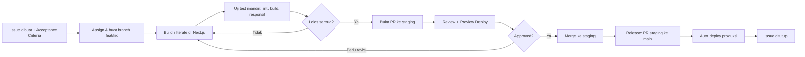

# CONTRIBUTING — Aturan Kerja & Uji Test

Dokumen ini mengikat semua developer yang berkontribusi ke repository ini.

---

## 1. Prinsip Dasar

1. **Semua pekerjaan berawal dari Issue.** Tidak ada commit tanpa Issue yang jelas.
2. **`staging` adalah branch integrasi utama.** Semua branch fitur/bugfix wajib membuat PR dengan target base branch **`staging`**, bukan langsung ke `main`.
3. **`main` selalu deployable & produksi.** Merge ke `main` hanya dilakukan dari branch `staging` saat rilis produksi.
4. **Satu Issue = Satu Branch = Satu Pull Request ke `staging`.**
5. **Tidak ada PR yang di-merge tanpa preview deploy hijau + review.**
6. **PRD adalah sumber kebenaran.** Kalau PR keluar dari scope PRD, sesuaikan PRD terlebih dahulu.

---

## 2. Branch Strategy

| Branch | Fungsi | Boleh Push Langsung? | Target PR Dari Fitur |
|--------|--------|----------------------|----------------------|
| `main` | Produksi | ❌ Tidak | Dimerge dari `staging` (Release) |
| `staging` | Integrasi & Staging Utama | ❌ Tidak (via PR) | **✅ Target PR Wajib** |
| `feat/*` | Fitur baru | ✅ Ya | Wajib PR ke `staging` |
| `fix/*` | Perbaikan bug | ✅ Ya | Wajib PR ke `staging` |
| `chore/*` | Config, dependency, dokumentasi | ✅ Ya | Wajib PR ke `staging` |

> ⚠️ **PENTING**: Jangan pernah membuka Pull Request dari branch `feat/*`, `fix/*`, atau `chore/*` langsung ke `main`. Selalu pilih **base: `staging`** saat membuat PR di GitHub.

**Format nama branch:**
```
[type]/[nomor-issue]-[slug-singkat]

Contoh:
feat/12-hero-section
fix/23-mobile-menu-overflow
chore/45-setup-eslint
```

---

## 3. Konvensi Commit

Gunakan **Conventional Commits**:

```
[type]([scope]): [deskripsi singkat, huruf kecil, tanpa titik]

Contoh:
feat(hero): tambah headline dan CTA primer
fix(nav): perbaiki overflow menu di viewport 360px
style(tokens): sesuaikan color token dengan PRD
perf(image): optimasi aset hero dengan next/image
docs(prd): update acceptance criteria section menu
```

| Type | Kapan Dipakai |
|------|---------------|
| `feat` | Fitur / section baru |
| `fix` | Perbaikan bug |
| `style` | Perubahan visual / styling tanpa ubah logika |
| `refactor` | Rapikan kode, hasil akhir sama |
| `perf` | Optimasi performa |
| `docs` | Dokumentasi |
| `chore` | Dependency, config, CI/CD |

---

## 4. Aturan Issue

### 4.1 Wajib
- Judul deskriptif, bukan generic seperti `perbaiki halaman`.
- Melampirkan **label**, **acceptance criteria**, dan **referensi section PRD**.
- Issue yang tidak punya acceptance criteria **tidak boleh dikerjakan**.

### 4.2 Label Standar

| Label | Arti |
|-------|------|
| `type: feature` | Section / fitur baru |
| `type: bug` | Sesuatu tidak berfungsi |
| `type: design` | Penyesuaian visual |
| `type: perf` | Performa / ukuran bundle |
| `type: a11y` | Aksesibilitas |
| `type: content` | Copywriting / aset |
| `priority: P0` | Blocker rilis |
| `priority: P1` | Penting, tidak blocker |
| `priority: P2` | Nice to have |
| `status: blocked` | Menunggu dependensi |

### 4.3 Template Issue — Feature

```markdown
### Referensi PRD
Section: 3.x — [Nama Section]

### Deskripsi
[Apa yang harus dibangun]

### Acceptance Criteria
- [ ] [Kriteria terukur 1]
- [ ] [Kriteria terukur 2]
- [ ] Responsif di breakpoint mobile, tablet, desktop
- [ ] Tidak ada error di console browser

### Referensi Desain
[Link Figma / screenshot / mockup]

### Out of Scope
- [Apa yang TIDAK dikerjakan di issue ini]
```

### 4.4 Template Issue — Bug

```markdown
### Deskripsi Bug
[Apa yang terjadi]

### Langkah Reproduksi
1. [Langkah 1]
2. [Langkah 2]

### Hasil yang Diharapkan
[Perilaku yang seharusnya]

### Hasil Aktual
[Perilaku yang salah saat ini]

### Lingkungan
- Browser: [Chrome / Safari / Firefox]
- Device / viewport: [contoh: iPhone 13 / 390px]
- URL / branch: [contoh: feat/12-hero-section]

### Screenshot
[Lampirkan screenshot jika ada]
```

---

## 5. Aturan Pull Request

### 5.1 Batasan Wajib

| Aturan | Ketentuan |
|--------|-----------|
| Target Base Branch | **Wajib `staging`** untuk semua PR fitur (`feat/*`), bugfix (`fix/*`), dan chore (`chore/*`) |
| Ukuran PR | Maksimal ~400 baris perubahan. Lebih dari itu, pecah menjadi beberapa PR terpisah |
| Referensi Issue | Wajib — gunakan `Closes #[nomor]` |
| Status build & lint | Wajib hijau (`npm run lint` & `npm run build`) sebelum request review |
| Preview deploy | Wajib dilampirkan di deskripsi PR (Vercel Preview / Cloudflare) |
| Reviewer | Minimal 1 approval |
| Self-merge | Tidak diperbolehkan tanpa approval |
| Konflik | Wajib diselesaikan oleh pembuat PR, bukan reviewer |
| Draft PR | Gunakan status Draft jika pekerjaan belum selesai / belum siap direview |

### 5.2 Template Pull Request

```markdown
## Ringkasan
[Apa yang diubah dan alasannya]

Closes #[nomor issue]

## Jenis Perubahan
- [ ] Fitur baru
- [ ] Perbaikan bug
- [ ] Penyesuaian desain
- [ ] Optimasi performa
- [ ] Dokumentasi & konfigurasi

## Bukti Visual
| Sebelum | Sesudah |
|---------|---------|
| [gambar/gif] | [gambar/gif] |

Preview URL: [https://...]

## Checklist Uji Test Developer (wajib dicentang sebelum request review)
- [ ] `npm run lint` lolos tanpa error / warning
- [ ] `npm run build` berhasil tanpa error
- [ ] Sudah diuji di viewport mobile (360px - 414px), tablet (768px), dan desktop (1024px+)
- [ ] Sudah diuji di minimal 2 browser modern (Chrome, Safari, Firefox, atau Edge)
- [ ] Tidak ada error/warning baru di console browser
- [ ] Tidak ada layout shift atau elemen meluap/overflow keluar layar
- [ ] Semua gambar menggunakan komponen Next.js Image (`next/image`) dengan `alt` yang jelas
- [ ] Semua link dan CTA mengarah ke tujuan yang benar
- [ ] Navigasi keyboard (Tab) berfungsi dan outline/focus state terlihat
- [ ] Kontras teks memenuhi standar WCAG AA
- [ ] Lighthouse Performance ≥ 90 pada halaman yang diubah
- [ ] Tidak ada dependensi baru, atau sudah dijelaskan alasannya di bawah
- [ ] Semua acceptance criteria di Issue sudah terpenuhi

## Dependency Baru
[Nama package + alasan, atau "Tidak ada"]

## Catatan untuk Reviewer
[Bagian kode yang perlu perhatian khusus]
```

---

## 6. Batasan Uji Test (Testing Boundaries)

### 6.1 Yang Wajib Diuji Setiap Developer (sebelum buka PR)

| Kategori | Batasan Minimum |
|----------|-----------------|
| **Lint & Type Check** | `npm run lint` lolos tanpa error/warning |
| **Build & Run** | `npm run build` dan `npm run start` berjalan lancar tanpa error |
| **Responsif** | Diuji minimal di lebar `360px` (Mobile), `768px` (Tablet), `1440px` (Desktop) |
| **Browser** | Minimal 2 browser: Chrome + Safari (atau Chrome + Firefox/Edge) |
| **Console** | Nol error, nol warning baru |
| **Aksesibilitas** | Alt text lengkap, hierarki heading (`h1`-`h6`) berurutan, focus ring terlihat |
| **Performa** | Lighthouse Performance ≥ 90, optimasi aset via `next/image` |
| **Konten** | Tidak ada `lorem ipsum` atau placeholder yang tertinggal |
| **Link & Navigasi** | Semua route internal & link eksternal berfungsi normal |

### 6.2 Yang Diuji oleh Reviewer

- Kesesuaian dengan **acceptance criteria di Issue**.
- Kesesuaian dengan **design token & typography rules di PRD**.
- Konsistensi antar section (spacing, ukuran font, warna, styling).
- Kerapian struktur komponen Next.js dan tidak ada scope creep di luar Issue.

### 6.3 Yang Tidak Diuji di Project Ini (Out of Testing Scope)

- Unit test / integration test otomatis (tidak diwajibkan untuk landing page & web profil statis)
- E2E test otomatis (Cypress / Playwright)
- Load & stress testing
- Pengujian backend kompleks / database migration

<!-- Sesuaikan jika di kemudian hari tim memutuskan menambahkan test otomatis. -->

### 6.4 Definition of Done

Sebuah Issue dianggap selesai jika **dan hanya jika**:

1. Semua acceptance criteria tercentang.
2. Checklist uji test di PR tercentang seluruhnya (`npm run lint` & `npm run build` lolos).
3. Preview deploy berhasil dan sudah dicek manual.
4. Sudah di-approve minimal 1 reviewer.
5. PR ter-merge ke branch **`staging`** dan Issue tertutup otomatis (lalu `staging` di-merge ke `main` saat rilis).

---

## 7. Alur Kerja Ringkas



---

## 8. Referensi

- `PRD.md` — sumber kebenaran scope, desain, dan acceptance criteria.
- Metodologi PRD & vibe coding: `Plan → Build → Iterate → Save → Go Live`.